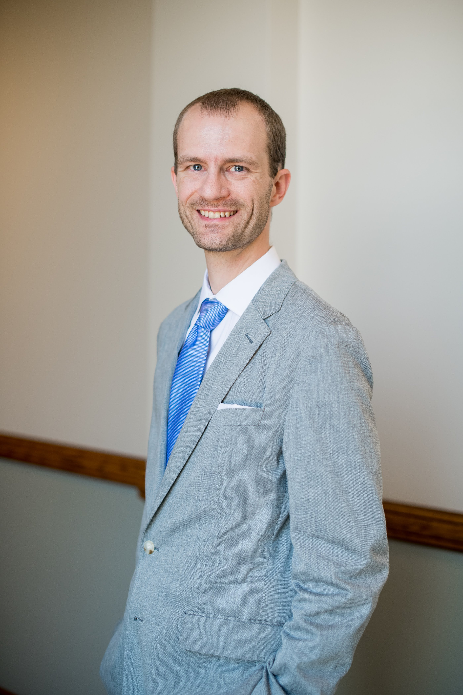

```{r,echo=FALSE}
#htmltools::tags$iframe(title="cv",src="paschall_cv_11.19.21.html",width=1000,height=200)
#rmarkdown::render_site()
      #
library("vembedr")
```

```{r,echo=FALSE,out.width=300,out.extra='style="float:right; padding:10px"'}
#
```
I am a **[senior lecturer and program coordinator](https://advanced.jhu.edu/directory/collin-paschall/)** in the **[Center for Advanced Governmental Studies](https://advanced.jhu.edu/about/centers/center-for-advanced-governmental-studies/)** at Johns Hopkins University. I've been in this role since 2019. Prior to my current position, I earned my PhD in the Department of Political Science at the University of Illinois at Urbana-Champaign (2018). After graduate school, I served as an American Political Science Association Congressional Fellow. I also hold a J.D. from The George Washington University Law School (2011), and I am native Nebraskan and graduate of the University of Nebraska-Lincoln (2008).

My work is at the intersection of government and data analytics. I teach courses in social science research design, statistical programming and analysis, and American politics. My research covers a range of topics in American political behavior and institutions. I've worked in the areas of Congressional legislative behavior, the consequences of Congressional scandals, mass political opinion, and the role of expertise in American politics and policy making.

I am based out of Columbus, Ohio and travel to DC for work and department events on a regular basis.

You can find a copy of my CV **[here](http://collinpaschall.github.io/paschall_cv11.19.21.pdf)**.


# Teaching

I split my teaching duties between two programs in the Center for Advanced Governmental Studies at Johns Hopkins University: the **[M.A. in Government](https://advanced.jhu.edu/academics/graduate/ma-government/)** and the **[M.S. in Data Analytics and Policy](https://advanced.jhu.edu/academics/graduate/ms-data-analytics-policy/)**. I typically teach 5 courses a year, in the spring, summer, and fall semesters. I have personally developed all the courses I currently teach.

### Research and Thesis I

Research and Thesis I is the first course in the M.A. in Government thesis sequence. Our M.A. in Government program culminates in a portfolio thesis of three chapters (papers) that are substantively and thematically related. In the course, I provide an overview of social scientific inquiry. You can review a recent syllabus **[here](http://collinpaschall.github.io/paschall_rt1.pdf)**.

### Data Visualization

Data Visualization is a core course in the M.S. in Data Analytics and Policy program. The course covers creating static and interactive visualizations in Tableau and R. The R portion of the course is based on ggplot and the tidyverse. It also includes an introduction to dashboard development and R Shiny applications. You can review a recent syllabus **[here](https://collinpaschall.github.io/paschall_data_viz.pdf)**.

Parts of this course have been adapted into a **[Coursera specialization](https://www.coursera.org/specializations/jhu-data-visualization-dashboarding-with-r)** that I continue to manage. The Coursera offering has more than 10,000 enrollments. 

### Unleashing Open Data with Python

Unleashing Open Data with Python is an introduction to data analysis in Python. It is designed for intermediate R users who want to be able to analyze rectangular data sets in Python. The course also includes an introduction to accessing data through APIs and a very brief overview of web scraping. For the final project, students write a short research note and post replication code on GitHub. You can review a recent syllabus **[here](https://collinpaschall.github.io/paschall_python.pdf)**.

# Research

I have a diverse research agenda covering American political institutions and behavior. My dissertation research in graduate school focused on the legislative strategies of members of Congress, and I have also written on Congressional scandal. With Benjamin Kantack of Lycoming College, I am engaged in on-going projects related to mass attitudes in contentious policy domains like gun control, climate change, and structural racism. 

I also have an interest in the politics of expertise and how expertise influences policy making. In my forthcoming book (with Ben Ginsberg), **Speaking Truth to Power: Expertise, Politics and Governance**, we examine how experts, or truth-tellers, succeed - or fail - to inform decision-makers and resolve conflicts in American public life. Ultimately, we show that while experts are indeed important in crafting solutions to problems, "truth" can also be a servant to the powerful and is not a substitute for broader democratic processes. The book is complete and will be available in fall 2022 from Edward Elgar Publishing. 

```{r,echo=FALSE}
#embed_youtube("zNzZ1PfUDNk")
```
