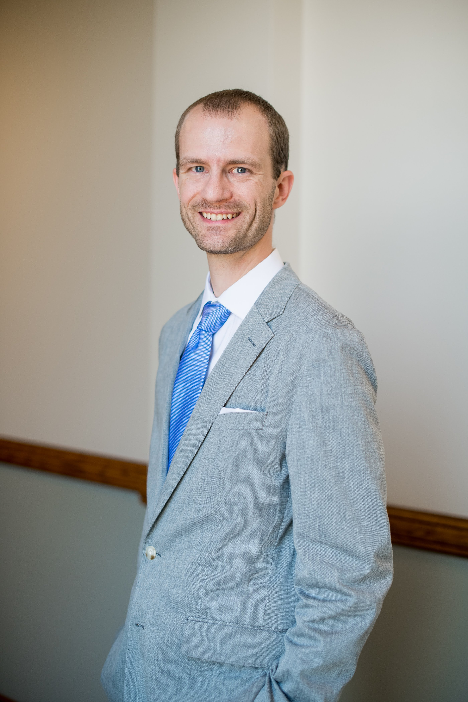

```{r,echo=FALSE,out.width=300,out.extra='style="float:right; padding:10px"'}
#
#random thing for commit
```


You can find a copy of my CV [here](http://collinpaschall.github.io/Paschall_cv_8_27_25.pdf), or you can view a short resume that covers my recent work at JHU [here](http://collinpaschall.github.io/Paschall_resume_short_8_27_25.pdf).


I am the [Program Director for the Data Analytics and Policy Program](https://advanced.jhu.edu/directory/collin-paschall/) in the [Center for Data Analtyics, Policy, and Government](https://advanced.jhu.edu/about/centers/center-for-advanced-governmental-studies/) at Johns Hopkins University. I've been with JHU since 2019. I am based out of central Ohio and travel back to DC and Baltimore frequently for program events and administrative gatherings. 

My work is at the intersection of data analytics and government. I teach courses in statistical programming and analysis, data science methods, American politics, and research design. 

My PhD training was in political science, but I have robust data science skills in R and Python, including econometric analysis, machine learning/predictive analytics, and data visualization.

Prior to my current position, I earned my PhD in the Department of Political Science at the University of Illinois at Urbana-Champaign (2018). After graduate school, I served as an American Political Science Association Congressional Fellow. I also hold a J.D. from The George Washington University Law School (2011). I am originally from Omaha, Nebraska and I earned by B.A. from the University of Nebraska-Lincoln (2008).

# Administration and Leadership

I am the chief administrator, content expert, and curriculum architect for the Data Analytics and Policy program (DAP) at JHU. DAP is an interdisciplinary master's degree that combines training in computational statistics, data management, and emerging technologies as applied to the public sector.

Along with teaching courses in data science methods and American politics, my responsibilities include overseeing the curriculum lifecycle, from conceptualization to quality assurance and continuous improvement. I hire and manage a team of full-time and part-time faculty, and I also collaborate with colleagues in the School of Arts and Sciences on program development, instructional design, faculty governance, event planning, admissions, and marketing.

DAP is part of the Center for Data Analytics, Policy, and Government, a suite of six interrelated programs focusing on data science and public administration. DAP serves more than 150 students, and the Center as a whole serves approximately 700.

# Teaching

Although I am primarily focused on teaching in the [M.S. in Data Analytics and Policy](https://advanced.jhu.edu/academics/graduate/ms-data-analytics-policy/) program, I have also offered courses in the [M.A. in Government](https://advanced.jhu.edu/academics/graduate/ma-government/) and the [M.A. in Public Management](https://advanced.jhu.edu/academics/graduate/ma-public-management). 

Course I have designed and offered include:

AS 470.768: Programming and Data and Management

AS 470.673: Data Visualization 

AS.470.709: Quantitative Methods 

AS.470.667: Machine Learning Methods and Applications

AS.470.862: Capstone for Data Analytics and Policy 

AS.470.662: Expertise and Evidence in Policymaking

AS 470.643: Text As Data

AS 470.850: Research and Thesis I 

# Research

While my primary duties are administrative and curricular, I have research interests in American political institutions and behavior. My dissertation research focused on the legislative strategies of members of Congress, and I have also written on Congressional scandal [(1)](https://journals.sagepub.com/doi/full/10.1177/1065912919826224?casa_token=HsEn5WMixbkAAAAA%3AcGqU6SiI_0vZdmV8_pQ3MusNNTUaFy-wWPReV0Ybh7Ai7Tap2lgGJQFpsHqYD5dXXT0KcF4NIgwVvA) [(2)](https://www.emerald.com/insight/content/doi/10.1108/978-1-80117-119-920221015/full/html). With Benjamin Kantack of Lycoming College, I have written about mass attitudes in contentious policy domains like [gun control](https://onlinelibrary.wiley.com/doi/abs/10.1111/ssqu.12754?casa_token=FQGUM-fubzUAAAAA:y4TRc4Z6VvlsSX7aKNh13sFjoz9R4FaNRB3DuRAl45r0T0mGiPIu4ExsfesAgcJdiaCjWCVq6utWbNw), [climate change, and structural racism](https://journals.sagepub.com/doi/full/10.1177/09636625221133520?casa_token=yc--4qil76wAAAAA%3AIgI6ZpyqXTk-e2z4PQtdkrzNCn7x6tY8NzuSy7uxIYcTjCP-aXM4RAU4bBhB8dqwDlMYg2aJ5tS9Mw).

I also have an interest in the politics of expertise and how expertise influences policy making. In my book (with Ben Ginsberg), [Speaking Truth to Power: Expertise, Politics and Governance](https://www.e-elgar.com/shop/usd/speaking-truth-to-power-9781803927626.html), we examine how experts, or truth-tellers, succeed - or fail - to inform decision-makers and resolve conflicts in American public life. Ultimately, we show that while experts are indeed important in crafting solutions to problems, "truth" can also be a servant to the powerful and is not a substitute for broader democratic processes.
